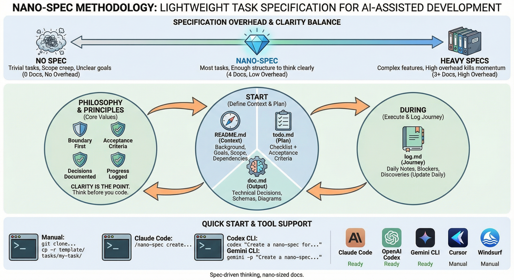

# Nano Spec

English | [中文版](./README_CN.md)

[](https://github.com/tao-hpu/nano-spec)
[](https://github.com/tao-hpu/nano-spec/fork)
[](https://github.com/tao-hpu/nano-spec/issues)
[](./LICENSE)

> Spec-driven thinking, nano-sized docs.

A lightweight task specification methodology for AI-assisted development. Inspired by [Kiro's Spec-Driven Development](https://kiro.dev/docs/specs/), but minimal and practical.



## The Problem

In the age of AI-assisted development, we face a documentation dilemma:

```
No Documentation          ???          Heavy Documentation
     |                     |                    |
     v                     v                    v
  "Just code it"     Sweet Spot         PRD + Design Doc
  Fast but messy     nano-spec          + Tech Spec + ...
  Scope creep        4 tiny docs        Complete but slow
  Hard to handoff    Clear thinking     Docs > Code time
```

**Most tasks live in the middle** — too complex for "just do it", too simple for enterprise-grade specs.

## Why nano-spec?

Modern AI coding assistants (Claude Code, Cursor, Copilot, etc.) are powerful, but they work better when you know what you want. Without clear specs:

- AI generates code that misses the point
- You spend more time correcting than coding
- Scope creeps because boundaries were never defined
- Handoffs become painful knowledge transfers

**nano-spec** is the sweet spot between "no documentation" and "documentation overhead":

- **4 documents, ~10 minutes to set up**
- **Forces clarity before coding**
- **AI-friendly structure** — easy for AI assistants to understand and follow
- **Human-friendly too** — great for team handoffs and future you

| Approach | Docs | Overhead | Best For |
|:---|:---:|:---:|:---|
| No spec | 0 | None | Trivial tasks |
| **nano-spec** | 4 | Low | Most tasks |
| Kiro SPEC | 3+ | High | Complex features |

## The 4 Documents

```
tasks/{task-name}/
├── README.md   # Context: What & Why
├── todo.md     # Plan: Tasks & Acceptance Criteria
├── doc.md      # Output: Decisions & Conclusions
└── log.md      # Journey: Daily progress & learnings
```

| Document | Purpose | When to Write |
|:---|:---|:---|
| README.md | Background, goals, scope, dependencies | At start |
| todo.md | Checklist + acceptance criteria | At start, update as you go |
| doc.md | Technical decisions, schemas, diagrams | During & after |
| log.md | Daily notes, blockers, discoveries | Daily |

## Core Principles

1. **Boundary first** - Define what's in/out of scope before coding
2. **Acceptance criteria** - Know when you're done
3. **Decisions documented** - Future you will thank present you
4. **Progress logged** - Track the journey, not just the destination

## Installation

### For Claude Code

```bash
# User-level (available in all projects)
mkdir -p ~/.claude/commands/
cp .claude/commands/nano-spec.md ~/.claude/commands/

# Or project-level (current project only)
mkdir -p /your-project/.claude/commands/
cp .claude/commands/nano-spec.md /your-project/.claude/commands/
```

> **Note**: You only need the command file. When you run `/nano-spec create`, Claude will generate the 4 documents based on your description. No template folder required.

### For Codex CLI

```bash
mkdir -p /your-project/.codex/
cp .codex/AGENTS.md /your-project/.codex/
```

### For Gemini CLI

```bash
# Copy to project root (Gemini CLI reads GEMINI.md hierarchically)
cp .gemini/GEMINI.md /your-project/GEMINI.md

# Or keep in .gemini folder
cp -r .gemini/ /your-project/

# You can also set global instructions at ~/.gemini/GEMINI.md
```

### For Cline (VS Code Extension)

```bash
# Single file format (simple)
cp .clinerules /your-project/

# Or directory format (for multiple rule files)
mkdir -p /your-project/.clinerules/
cp .clinerules /your-project/.clinerules/nano-spec.md
```

### For Cursor

```bash
# New format (recommended, .mdc with frontmatter)
mkdir -p /your-project/.cursor/rules/
cp .cursor/rules/nano-spec.mdc /your-project/.cursor/rules/

# Legacy format (still works, but will be deprecated)
cp .cursorrules /your-project/
```

> **Note**: Cursor is transitioning from `.cursorrules` to the new `.cursor/rules/*.mdc` format. The new format supports metadata like `description`, `globs`, and `alwaysApply` for better rule management.

### For Windsurf

```bash
# Copy to project root
cp .windsurfrules /your-project/
```

### For Trae

```bash
# Copy to project root (Trae reads .trae/rules/)
cp -r .trae/ /your-project/
```

### For GitHub Copilot

```bash
# Copy to project root
cp -r .github/ /your-project/
```

## Quick Start

### Manual Setup

```bash
# Clone the template
git clone https://github.com/tao-hpu/nano-spec.git
cd nano-spec

# Create a new task
cp -r template/ tasks/my-new-task/
```

### With Claude Code

```bash
# Use the built-in slash command
/nano-spec create my-new-task "Brief description of the task"
```

### With Codex CLI

```bash
codex "Create a nano-spec for: my task description"
```

### With Gemini CLI

```bash
# One-off prompt
gemini -p "Create a nano-spec for: my task description"

# Or interactive mode
gemini -i "Create a nano-spec for: my task description"
```

### With Cline

In VS Code with Cline extension, just type:
```
Create a nano-spec for: my task description
```

### With Cursor / Windsurf / Trae / GitHub Copilot

In any of these editors, just type in chat:
```
Create a nano-spec for: my task description
```

## Tool Support

| Tool | Config Location | Status |
|:---|:---|:---:|
| Claude Code | `.claude/commands/nano-spec.md` | Ready |
| OpenAI Codex | `.codex/AGENTS.md` | Ready |
| Gemini CLI | `GEMINI.md` or `.gemini/GEMINI.md` | Ready |
| Cline | `.clinerules` or `.clinerules/*.md` | Ready |
| Cursor | `.cursor/rules/nano-spec.mdc` | Ready |
| Windsurf | `.windsurfrules` | Ready |
| Trae | `.trae/rules/project_rules.md` | Ready |
| GitHub Copilot | `.github/copilot-instructions.md` | Ready |

### Two Types of Integration

**CLI tools with native command systems** (Claude Code, Codex CLI, Gemini CLI):
- Have built-in command/agent/skill systems
- Config files define structured commands that can be invoked directly (e.g., `/nano-spec create`)
- More powerful: can define arguments, actions, and workflows

**IDE wrappers over LLM APIs** (Cursor, Windsurf, Cline, Trae, Copilot):
- Essentially UI layers on top of model APIs
- Config files are injected as system prompts to guide AI behavior
- Usage is natural language only: `Create a nano-spec for: my task`

Both approaches work well — the difference is in how you invoke nano-spec, not in the output quality.

## Template Structure

Each document template is designed to be minimal yet complete:

### README.md (Context)
- Background: Why does this task exist?
- Goals: What are we trying to achieve?
- Scope: What's in and out of scope?
- Dependencies: What do we need before starting?

### todo.md (Plan)
- Research: What do we need to learn first?
- Implementation: Step-by-step tasks
- Verification: How do we validate success?
- Acceptance Criteria: Must-have vs nice-to-have

### doc.md (Output)
- Summary: One-paragraph outcome
- Key Decisions: Options considered and rationale
- Technical Details: Architecture, schemas, interfaces
- Open Questions: Unresolved issues

### log.md (Journey)
- Daily entries: Done, In Progress, Blocked, Notes
- Captures discoveries and learnings
- Helps with handoffs and retrospectives

## Workflow & Commands

### Step 1: Create Spec (Before Coding)

| Tool | Command |
|:---|:---|
| Claude Code | `/nano-spec create auth-feature "User authentication with OAuth2"` |
| Codex CLI | `codex "Create a nano-spec for: user authentication with OAuth2"` |
| Gemini CLI | `gemini -p "Create a nano-spec for: user authentication with OAuth2"` |
| Cline / Cursor / Windsurf / Trae / Copilot | `Create a nano-spec for: user authentication with OAuth2` |
| Manual | `cp -r template/ tasks/auth-feature/` then edit files |

### Step 2: During Development

Keep your AI assistant informed. Paste context or ask it to update docs:

```
# Check current progress
"Read my todo.md and tell me what's left"

# Log today's work
"Add to log.md: implemented OAuth2 callback, blocked on token refresh"

# Record a decision
"Add to doc.md: decided to use JWT instead of sessions because..."

# Update task status
"Mark 'implement login endpoint' as done in todo.md"
```

### Step 3: Handoff or Review

Share the 4 files for instant context:

```
# Quick status
"Summarize the current state from log.md and todo.md"

# Full context for new team member
"Read all 4 files in tasks/auth-feature/ and explain the project"

# Scope check
"Someone asked for feature X. Is it in scope per README.md?"
```

### Common Prompts Reference

**Claude Code slash commands:**
| Scenario | Command |
|:---|:---|
| Create new task | `/nano-spec create my-task "description"` |
| Check progress | `/nano-spec status my-task` |
| Update spec | `/nano-spec update my-task "what to change"` |

**Natural language (all tools):**
| Scenario | Prompt |
|:---|:---|
| Update todo | `Mark [task] as done in todo.md` |
| Add decision | `Document in doc.md: we chose X over Y because...` |
| Daily log | `Add today's entry to log.md: [what you did]` |
| Scope question | `Is [feature] in scope for this task?` |
| Handoff | `Summarize tasks/[name]/ for a new developer` |

## Example

See [examples/notification-service/](./examples/notification-service/) for a real-world example demonstrating a notification service implementation.

## Philosophy

> "Think before you code, even with AI."

The documents aren't the point. **Clarity is.**

nano-spec is a thinking framework that happens to produce documents. It helps you:

- **Avoid scope creep** by defining boundaries upfront
- **Track progress** without complex project management tools
- **Document decisions** for future reference
- **Enable handoffs** with clear context and history

## Contributing

PRs welcome. Keep it nano.

- Bug reports and feature requests: [GitHub Issues](https://github.com/tao-hpu/nano-spec/issues)
- Improvements to templates or documentation are always appreciated

## License

MIT
