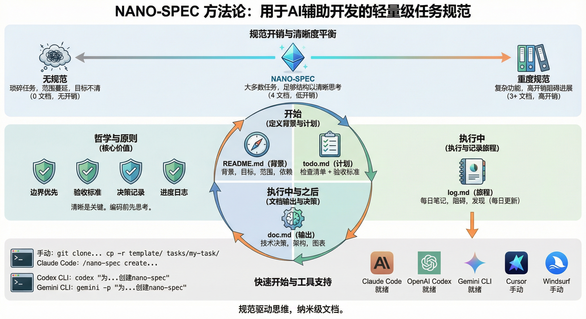

# Nano Spec

中文版 | [English](./README.md)

[](https://github.com/tao-hpu/nano-spec)
[](https://github.com/tao-hpu/nano-spec/fork)
[](https://github.com/tao-hpu/nano-spec/issues)
[](./LICENSE)

> 规范驱动思维，纳米级文档。

一个轻量级的任务规范方法论，专为 AI 辅助开发设计。灵感来自 [Kiro 的规范驱动开发](https://kiro.dev/docs/specs/)，但更简洁实用。



## 问题背景

在 AI 辅助开发的时代，我们面临一个文档困境：

```
无文档                    ???                 重文档
  |                        |                    |
  v                        v                    v
"直接写代码"            甜点区             PRD + 设计文档
快但混乱              nano-spec           + 技术方案 + ...
范围蔓延              4 个小文档            完整但慢
难以交接              思路清晰            写文档 > 写代码
```

**大多数任务都在中间地带** —— 太复杂不能"直接开干"，又没复杂到需要企业级规范。

## 为什么选择 nano-spec？

现代 AI 编程助手（Claude Code、Cursor、Copilot 等）功能强大，但当你清楚自己想要什么时，它们才能发挥最大作用。没有清晰的规范：

- AI 生成的代码可能偏离目标
- 你花在纠正上的时间比写代码还多
- 因为从未定义边界，范围不断蔓延
- 交接变成痛苦的知识转移

**nano-spec** 是"无文档"和"文档过载"之间的甜点区：

- **4 个文档，约 10 分钟搭建**
- **强制在编码前理清思路**
- **AI 友好的结构** —— AI 助手容易理解和遵循
- **人类也友好** —— 适合团队交接和未来的自己

| 方式 | 文档数 | 开销 | 适用场景 |
|:---|:---:|:---:|:---|
| 无规范 | 0 | 无 | 简单任务 |
| **nano-spec** | 4 | 低 | 大多数任务 |
| Kiro SPEC | 3+ | 高 | 复杂功能 |

## 4 个核心文档

```
tasks/{任务名}/
├── README.md   # 上下文：做什么 & 为什么
├── todo.md     # 计划：任务清单 & 验收标准
├── doc.md      # 产出：决策 & 结论
└── log.md      # 历程：每日进度 & 心得
```

| 文档 | 用途 | 何时编写 |
|:---|:---|:---|
| README.md | 背景、目标、范围、依赖 | 开始时 |
| todo.md | 任务清单 + 验收标准 | 开始时，持续更新 |
| doc.md | 技术决策、模式、图表 | 过程中 & 完成后 |
| log.md | 每日记录、阻塞点、发现 | 每天 |

## 核心原则

1. **边界优先** - 编码前先定义什么在范围内、什么在范围外
2. **验收标准** - 明确何时算完成
3. **决策留痕** - 未来的你会感谢现在的你
4. **进度留痕** - 记录过程，不只是结果

## 快速开始

### 手动设置

```bash
# 克隆模板
git clone https://github.com/tao-hpu/nano-spec.git
cd nano-spec

# 创建新任务
cp -r template/ tasks/my-new-task/
```

### 使用 Claude Code

```bash
# 使用内置的斜杠命令
/nano-spec create my-new-task "任务的简要描述"
```

### 使用 Codex CLI

```bash
codex "Create a nano-spec for: 我的任务描述"
```

### 使用 Gemini CLI

```bash
# 一次性提示
gemini -p "Create a nano-spec for: 我的任务描述"

# 或交互模式
gemini -i "Create a nano-spec for: 我的任务描述"
```

## 安装配置

### Claude Code

```bash
# 将命令复制到你的项目
mkdir -p /your-project/.claude/commands/
cp .claude/commands/nano-spec.md /your-project/.claude/commands/

# 或者复制整个模板文件夹
cp -r template/ /your-project/tasks/_template/
```

### Codex CLI

```bash
cp .codex/AGENTS.md /your-project/.codex/
```

### Gemini CLI

```bash
# 复制到项目根目录（Gemini CLI 会分层读取 GEMINI.md）
cp .gemini/GEMINI.md /your-project/GEMINI.md

# 或保留在 .gemini 文件夹
cp -r .gemini/ /your-project/
```

## 工具支持

| 工具 | 配置位置 | 状态 |
|:---|:---|:---:|
| Claude Code | `.claude/commands/nano-spec.md` | 已就绪 |
| OpenAI Codex | `.codex/AGENTS.md` | 已就绪 |
| Gemini CLI | `GEMINI.md` 或 `.gemini/GEMINI.md` | 已就绪 |
| Cursor | 复制到 `.cursorrules` | 手动 |
| Windsurf | 复制到 rules | 手动 |

## 模板结构

每个文档模板都设计得简洁而完整：

### README.md（上下文）
- 背景：这个任务为什么存在？
- 目标：我们要达成什么？
- 范围：什么在范围内、什么在范围外？
- 依赖：开始前需要什么？

### todo.md（计划）
- 调研：首先需要了解什么？
- 实施：分步骤的任务清单
- 验证：如何确认成功？
- 验收标准：必须完成 vs 锦上添花

### doc.md（产出）
- 摘要：一段话总结成果
- 关键决策：考虑过的方案及理由
- 技术细节：架构、模式、接口
- 待解决问题：尚未解决的问题

### log.md（历程）
- 每日记录：已完成、进行中、阻塞、备注
- 记录发现和心得
- 便于交接和复盘

## 示例

查看 [examples/notification-service/](./examples/notification-service/) 了解真实案例，演示通知服务的实现。

## 设计理念

> "即使有 AI，也要先想清楚再写代码。"

文档不是目的，**清晰才是。**

nano-spec 是一个思考框架，只是顺便产出了文档。它帮助你：

- **避免范围蔓延** - 提前定义边界
- **跟踪进度** - 无需复杂的项目管理工具
- **记录决策** - 留给未来参考
- **便于交接** - 清晰的上下文和历史

## 贡献

欢迎 PR，保持精简。

- Bug 报告和功能请求：[GitHub Issues](https://github.com/tao-hpu/nano-spec/issues)
- 欢迎改进模板或文档

## 许可证

MIT
